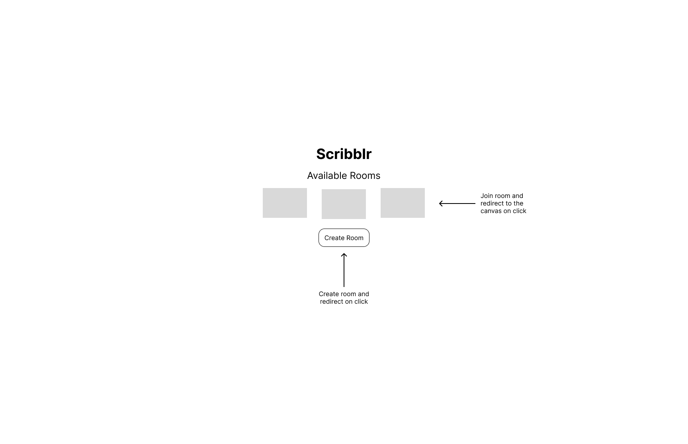
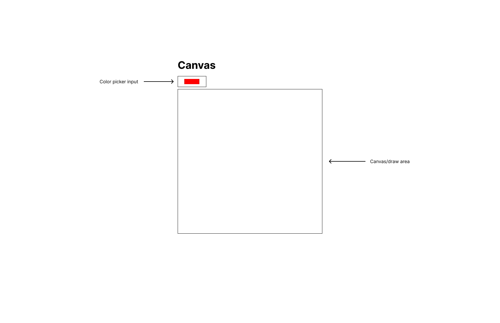

# Scribblr
An online collaborative drawing app written with Socket.io and Express.

[Demo](https://js-scribblr.herokuapp.com/)

## Why WebSockets?
WebSockets are used to sync drawings in real-time. Users can create rooms and see others' changes with little to no delay.

## Installation
1. Download or clone this repo to your computer
2. To install dependencies run `npm i`
3. Run `npm start` to start the app
4. To use the app navigate to localhost:3000

## Mockups

